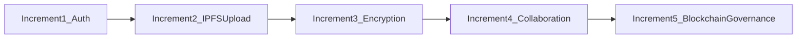
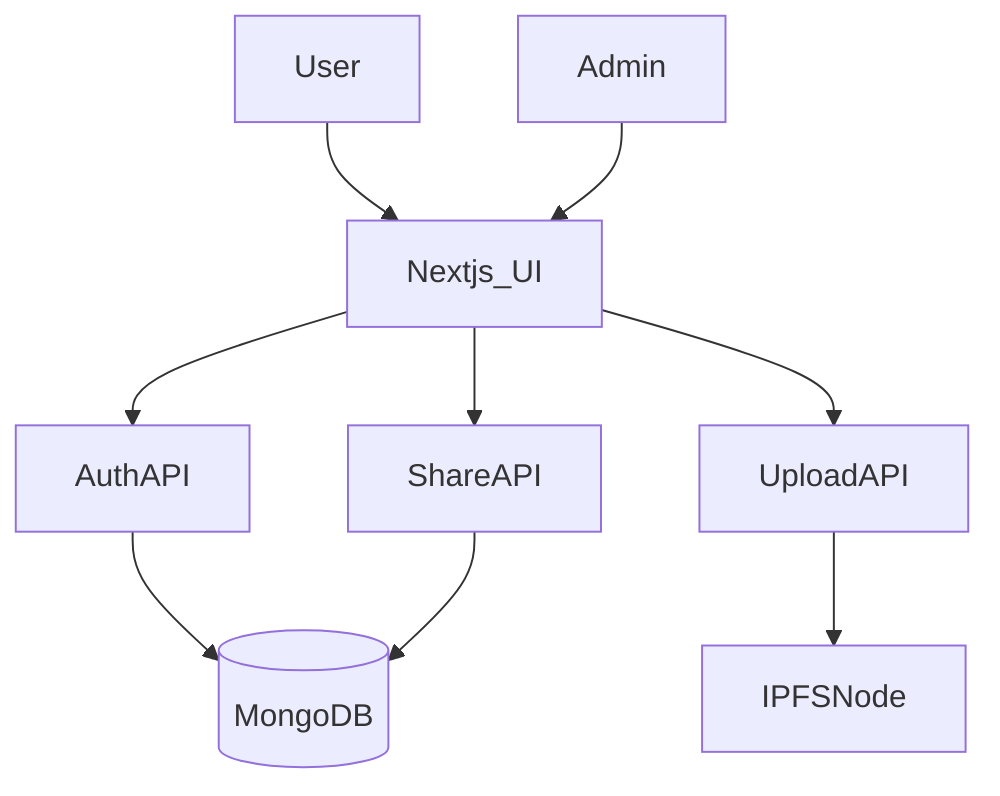
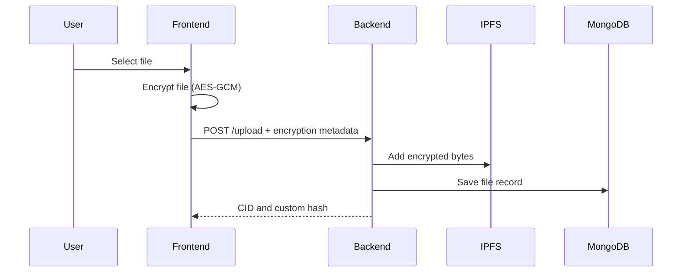
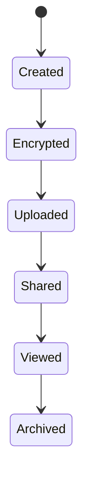
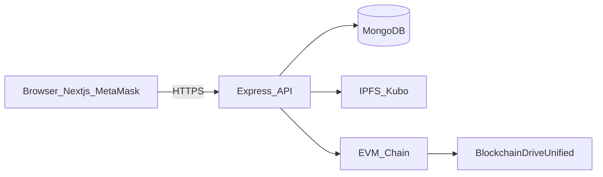
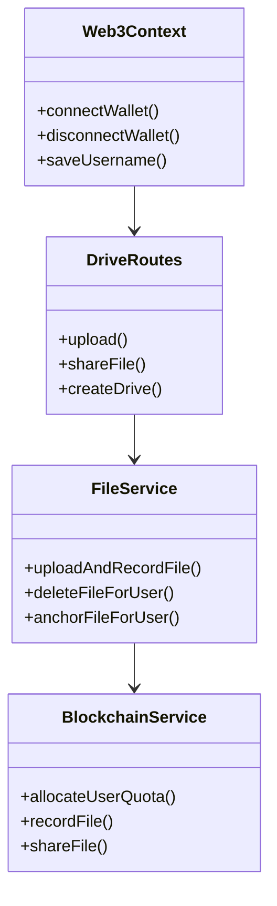
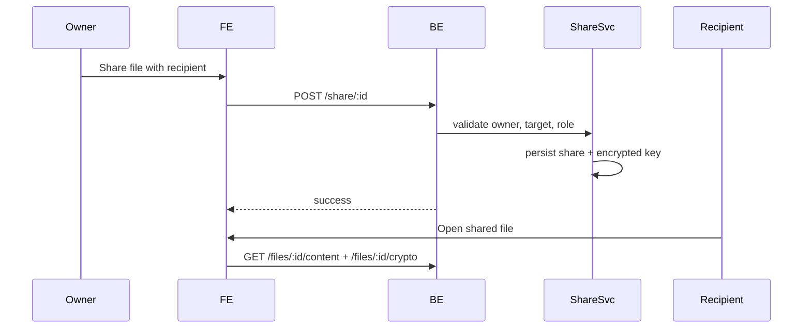
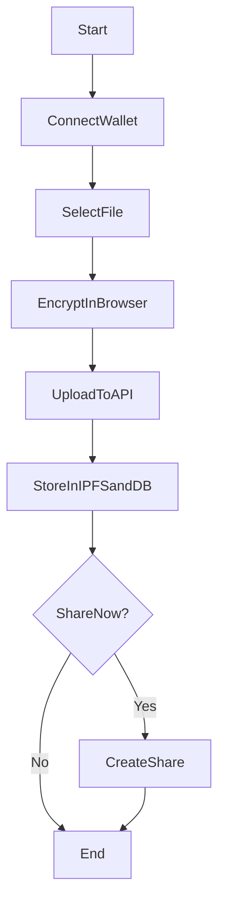
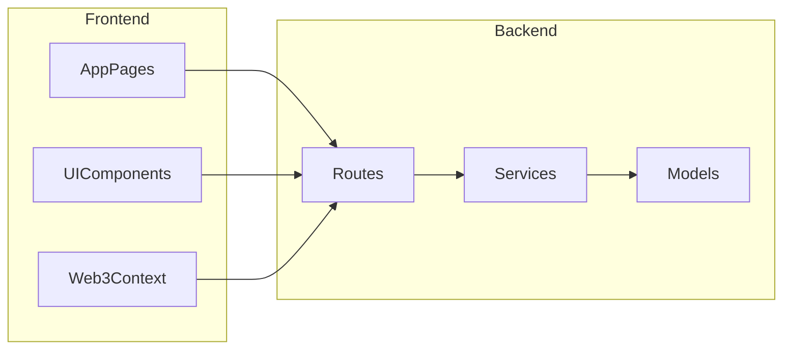
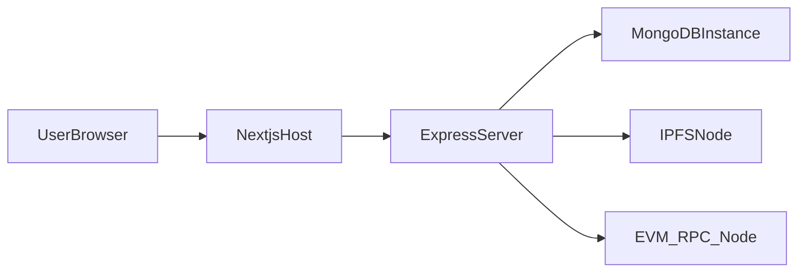

# SecureVault: Decentralized File Sharing System

## Supervisor's Recommendation
This report documents the design and implementation of SecureVault, a decentralized file sharing and collaboration platform. The project demonstrates practical integration of wallet authentication, client-side encryption, IPFS-based storage, and smart contract governed quota and access control.

## Letter of Approval
This document is prepared as the final project documentation for the SecureVault system and is submitted for academic and technical review.

## Acknowledgement
The SecureVault project was built with guidance from project mentors, open-source contributors, and maintainers of IPFS, Ethereum tooling, and modern JavaScript frameworks.

## Abstract
SecureVault is a decentralized storage and collaboration platform built to address trust and privacy limitations of traditional centralized cloud drives. The system combines MetaMask wallet authentication, client-side file encryption, IPFS content-addressed storage, MongoDB metadata indexing, and smart contract based quota and sharing control. Users upload encrypted files, organize them in drives and folders, and share access with role-based permissions. The architecture follows a modern full-stack pattern with a Next.js frontend and Express backend, while blockchain integration provides transparent quota/accountability behavior. The implementation validates that decentralized file workflows can be made practical with familiar user experience, while preserving privacy by ensuring plaintext data never leaves the browser during upload. The report presents the project background, analysis, design, implementation modules, test strategy, and future enhancements.

## Table of Contents
- Chapter 1: Introduction
- Chapter 2: Background Study and Literature Review
- Chapter 3: System Analysis
- Chapter 4: System Design
- Chapter 5: Implementation and Testing
- Chapter 6: Conclusion and Future Recommendations
- References
- Appendices

## List of Figures
- Figure 1.1: Incremental Development Model for SecureVault
- Figure 3.1: Use Case Diagram for SecureVault
- Figure 3.2: High-Level Schedule Overview
- Figure 3.3: Initial Class Model
- Figure 3.4: Upload and Share Sequence
- Figure 3.5: File Lifecycle State Diagram
- Figure 3.6: Activity Diagram for Upload Workflow
- Figure 4.1: SecureVault System Architecture
- Figure 4.2: High-Level Design
- Figure 4.3: Refined Class Diagram
- Figure 4.4: Refined Sequence Diagram
- Figure 4.5: Refined Activity Diagram
- Figure 4.6: Component Diagram
- Figure 4.7: Deployment Diagram

## List of Tables
- Table 3.1: Hardware Requirements
- Table 3.2: Software Requirements
- Table 3.3: Development Schedule
- Table 5.1: Unit Testing Cases
- Table 5.2: System Testing Cases

## List of Abbreviations
- IPFS: InterPlanetary File System
- CID: Content Identifier
- EVM: Ethereum Virtual Machine
- RBAC: Role-Based Access Control
- AES-GCM: Advanced Encryption Standard - Galois/Counter Mode
- DHT: Distributed Hash Table
- API: Application Programming Interface
- UI: User Interface

# CHAPTER 1 INTRODUCTION

## 1.1 Introduction
SecureVault is designed as a privacy-first decentralized file storage and sharing system. Unlike traditional cloud drives where providers can access or analyze user data, SecureVault performs encryption in the browser before upload, then stores ciphertext in IPFS. This architecture ensures that storage nodes and backend infrastructure do not require plaintext access.

The application supports collaborative usage through drives, folders, file sharing roles, comments, and expiring links. It also includes optional smart-contract-backed quota and permission enforcement for transparent governance.

## 1.2 Problem Statement
Conventional cloud storage introduces three key limitations:
1. Centralized trust dependency where providers hold complete control over stored files.
2. Inconsistent end-to-end encryption guarantees in shared workflows.
3. Limited transparency in quota and permission enforcement.

SecureVault addresses these limitations by combining wallet identity, client-side encryption, content addressing, and auditable access mechanisms.

## 1.3 Objectives
- Develop a decentralized file platform with practical UX.
- Integrate wallet-signature authentication for user identity.
- Encrypt files client-side using strong symmetric encryption.
- Store encrypted artifacts on IPFS and metadata in MongoDB.
- Support role-based sharing (viewer/editor/admin) in personal and collaborative drives.
- Provide optional blockchain-based quota and permission checks.

## 1.4 Scope and Limitation
### Scope
- Wallet-based login, profile bootstrap, and session management.
- Upload, listing, view, comments, and deletion of files.
- Collaborative drives with folder hierarchy and member roles.
- Direct file share, drive share, and expiring public links.
- Admin controls for user access and quota management.

### Limitation
- Availability depends on configured IPFS node/gateway uptime.
- Smart-contract enforcement is toggle-based and may run in mock mode.
- MetaMask encryption methods depend on wallet support and user approval.
- Local key cache improves UX but introduces browser-local dependency.

## 1.5 Development Methodology
The project follows an incremental model:
- Increment 1: Wallet auth, backend sessions, and user onboarding.
- Increment 2: File upload pipeline and IPFS integration.
- Increment 3: Browser encryption/decryption and secure key wrapping.
- Increment 4: Sharing, comments, drives/folders, and collaboration features.
- Increment 5: Blockchain quota/perms integration and admin controls.

## 1.6 Report Organization
This report is organized in six chapters covering project context, background concepts, requirements and feasibility analysis, system design, implementation and testing details, and concluding recommendations.

# CHAPTER 2 BACKGROUND STUDY AND LITERATURE REVIEW

## 2.1 Background Study
SecureVault builds on four technical pillars:
- Content-addressed storage via IPFS.
- Cryptographic confidentiality using AES-GCM and public-key envelope encryption.
- Wallet-centric authentication through MetaMask signatures.
- Access and quota governance via EVM smart contract interfaces.

IPFS provides CID-based immutable addressing, making deduplication and integrity checks natural. Client-side encryption ensures uploaded payloads remain private. Blockchain adds transparent state transitions for storage quotas and file-level sharing metadata.

## 2.2 Literature Review
Related systems and studies indicate a trend toward decentralized storage and verifiable access control:
- IPFS and Filecoin ecosystems for distributed persistence.
- Storj and Sia for decentralized object storage models.
- Blockchain access-control approaches for auditable sharing decisions.
- NaCl and modern browser cryptography for secure key exchange and local encryption.

SecureVault extends these ideas by combining them in a full-stack, user-facing drive workflow with practical collaboration features.

# CHAPTER 3 SYSTEM ANALYSIS

## 3.1 System Analysis
The system is analyzed as a multi-layer application:
- Frontend (Next.js) for wallet interaction, file workflows, and UI.
- Backend (Express) for API orchestration and authorization.
- Database (MongoDB) for users/files/shares/drives/comments metadata.
- IPFS for encrypted file content.
- Smart contract layer for optional enforcement of quota and sharing permissions.

## 3.2 Requirement Analysis
### Functional Requirements
- User wallet connection and signature verification.
- File upload, list, view, delete, and anchor operations.
- Encryption metadata handling and user-specific key retrieval.
- Sharing to user targets with roles and optional key delegation.
- Collaborative drive creation, invitation, and quota policy management.
- Admin user access and quota control.

### Non-Functional Requirements
- Security: end-to-end client-side encryption and session protection.
- Performance: responsive file operations and metadata retrieval.
- Usability: clear drive-style interface and navigation.
- Maintainability: modular services and route structure.
- Compatibility: modern browser + MetaMask extension support.

## 3.3 Feasibility Analysis
### Technical Feasibility
The stack uses mature technologies (`express`, `mongodb`, `ipfs-http-client`, `ethers`, Next.js). APIs are modularized by routes and services, reducing integration risk.

### Operational Feasibility
The user flow is wallet-first and does not require technical blockchain expertise beyond common MetaMask confirmation prompts.

### Economic Feasibility
The solution can run on commodity developer machines with local MongoDB, local/remote IPFS, and testnet blockchain endpoints.

### Schedule Feasibility
Incremental delivery enabled stepwise validation of auth, upload, encryption, sharing, and blockchain governance features.

## 3.4 Analysis Models

# CHAPTER 4 SYSTEM DESIGN

## 4.1 Design
SecureVault follows a layered architecture with strict boundary between plaintext handling (browser) and storage/metadata handling (backend + IPFS + DB).

## 4.2 Refined Class Diagram

## 4.3 Refined Sequence Diagram

## 4.4 Refined Activity Diagram

## 4.5 Component Diagram

## 4.6 Deployment Diagram

## 4.7 Algorithm Details
### 4.7.1 Custom Hashing
`utils/customHash.js` uses BLAKE3 (`@noble/hashes/blake3`) to produce deterministic custom identifiers for file metadata.

### 4.7.2 Client-Side File Encryption
`front end/lib/file-crypto.ts` encrypts files using AES-GCM in the browser and stores initialization vector + owner encrypted key metadata.

### 4.7.3 Key Wrapping for Sharing
The same module uses `tweetnacl` box with `x25519-xsalsa20-poly1305` payload format to wrap symmetric file keys for recipients.

### 4.7.4 Password-based Encryption Services
`algorithms/encryption/` contains configurable method profiles, PBKDF2-based derivation paths, and encryption/decryption helper logic.

### 4.7.5 On-chain Quota and Permission Controls
`contracts/BlockchainDriveUnified.sol` exposes functions for pool allocation, per-user quota updates, file recording, share grants, and access checks.

# CHAPTER 5 IMPLEMENTATION AND TESTING

## 5.1 Implementation
The backend entrypoint `server.js` initializes middleware, sessions, schema/index checks, and mounts route groups. The frontend uses app-router pages under `front end/app/` with modular components and React context.

## 5.2 Tools Used
### Frontend
- Next.js 16
- React 19
- Tailwind CSS + Radix UI
- Ethers v6

### Backend
- Node.js (ESM)
- Express
- Multer
- MongoDB driver

### Decentralized and Crypto Layer
- IPFS (`ipfs-http-client`)
- Solidity smart contract (`BlockchainDriveUnified.sol`)
- `tweetnacl`, browser Web Crypto, `@noble/hashes`, `bcrypt`

## 5.3 Implementation Details of Modules
### 5.3.1 Authentication Module
- Frontend context: `front end/context/web3-context.tsx`
- Backend APIs: `routes/authRoutes.js`

Flow: request nonce, sign with wallet, verify, initialize session, fetch `/me` profile and quota snapshot.

### 5.3.2 Upload and Encryption Module
- UI upload: `front end/components/upload-zone.tsx`
- Backend upload route: `routes/driveRoutes.js` (`POST /upload`)
- Service pipeline: `services/fileService.js`, `services/ipfsService.js`

### 5.3.3 Sharing Module
- Core services: `services/collaborationService.js`, `services/sharingService.js`
- APIs: `routes/driveRoutes.js` and `routes/sharing.js`

### 5.3.4 Drive and Folder Module
- APIs in `routes/driveRoutes.js` (`/api/drives/*`)
- Service logic in `services/driveService.js`

### 5.3.5 Blockchain Module
- `services/blockchain.js` for contract calls and mock/real modes
- `services/permissionService.js` for hybrid contract + DB access checks

### 5.3.6 Admin and RBAC Module
- Admin APIs: `routes/adminRoutes.js`
- Role/quota support: `services/userRoleService.js`

## 5.4 Testing
### Unit Testing Focus
- Encryption/decryption correctness.
- Share permission persistence.
- Quota checks before upload.
- Link-expiry resolution behavior.

### System Testing Focus
- End-to-end upload and preview.
- Cross-user sharing and decryption access.
- Collaborative drive member workflows.
- Admin quota updates reflected in `/me` and upload guards.

### Result Analysis
SecureVault successfully delivers encrypted decentralized file workflows with practical collaboration features. The design separates plaintext handling to the browser and relies on server-side metadata plus optional chain verification for policy transparency.

# CHAPTER 6 CONCLUSION AND FUTURE RECOMMENDATIONS

## 6.1 Conclusion
SecureVault demonstrates a complete decentralized file-sharing architecture that balances usability and security. The project validates that wallet-authenticated users can encrypt files locally, upload ciphertext to distributed storage, and collaborate with controlled access roles.

## 6.2 Future Recommendations
- Integrate persistent pinning strategy with managed IPFS/Filecoin providers.
- Add richer audit timelines and revocation notifications.
- Introduce threshold encryption for team-managed files.
- Expand mobile support with wallet-connect based flows.
- Strengthen formal permission proofs and policy simulation tools.

# References
1. Benet, J. IPFS - Content Addressed, Versioned, P2P File System.
2. Ethereum Foundation. Ethereum JSON-RPC and EVM execution model.
3. NIST. Recommendation for Block Cipher Modes of Operation: GCM.
4. Bernstein et al. NaCl Networking and Cryptography library.
5. O'Connor et al. BLAKE3 cryptographic hash function.

# Appendices
## Appendix A: Key Project Files
- `server.js`
- `routes/authRoutes.js`
- `routes/driveRoutes.js`
- `routes/adminRoutes.js`
- `services/fileService.js`
- `services/driveService.js`
- `services/sharingService.js`
- `services/blockchain.js`
- `front end/context/web3-context.tsx`
- `front end/lib/file-crypto.ts`
- `contracts/BlockchainDriveUnified.sol`

## Appendix B: Main Frontend Pages
- `/` (My Drive)
- `/collaborative`
- `/combined`
- `/shared`
- `/users`
- `/admin`
- `/blockchain`
- `/settings`

## Appendix C: Environment Configuration Summary
From `.env.example`:
- `PORT`, `SESSION_SECRET`
- `DB_HOST`, `DB_USER`, `DB_PASSWORD`, `DB_NAME`
- `IPFS_API_URL`, `IPFS_GATEWAY_URL`
- `RPC_URL`, `STORAGE_ALLOC_CONTRACT`, `DRIVE_V2_CONTRACT`, `ADMIN_PRIVATE_KEY`
- `ENFORCE_QUOTA_ON_UPLOAD`, `ENFORCE_CONTRACT_PERMISSIONS`, `ENFORCE_CONTRACT_SHARING`
